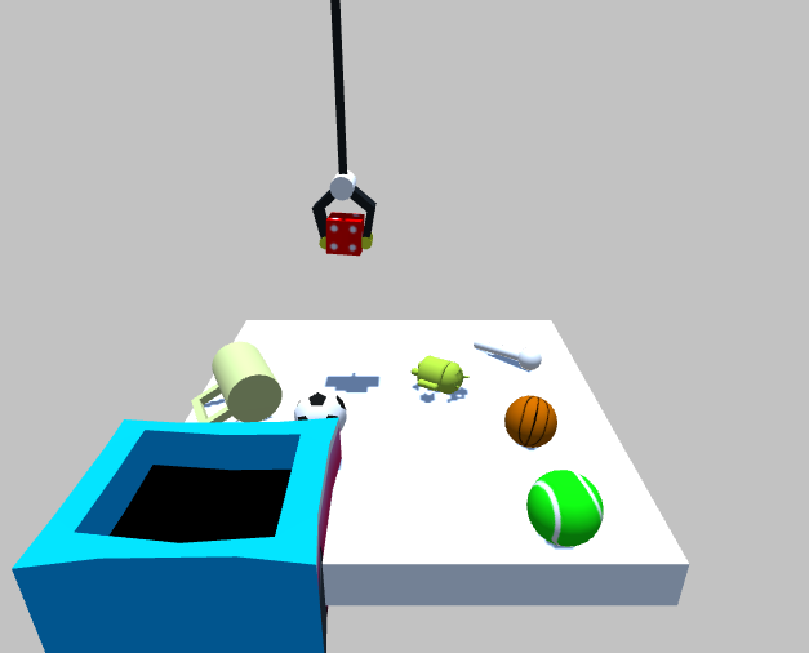

# Crane Game (Claw Machine) Simulator
For a machine learning project



## setup:
1. install lis (known to work for [this version](https://github.com/stssg526/lis/tree/lisver2))
2. replace lis/gym_client/gym/envs/unity folder with unity folder included here

## for manual play:
```
# ./test.x86_64 port render_every msg_server_every use_server object_spawn
./test.x86_64 5000 10 0 0 abbbc
```

## controls for manual play:
WASD to move, space to grab

## spawn code:
a = サイコロ

b = ダンベル

c = ボール（テニス）

d = マグカップ

e = マラッカ

f = ボール（バスケ）

g = ボール（サッカー）

h = アンドロイドマスコット

### example:
```
aaggdh
# -> サイコロ２個、サッカーボール２個、マグカップ１個、アンドロイド１個
```

